* Table of Contents
{:toc}

--------------------------------------------------------------------------------------------------------------------

## **Acknowledgements**

* The implementation of the status field is adapted from this [project's implementation of a similar feature.](https://github.com/AY2021S1-CS2103T-F11-3/tp/pull/124/files)
* The code for the removal of bullet points from the User Guide's table of content is reused from AY2021S1-CS2103T-W16-3's [PR #179](https://github.com/AY2021S1-CS2103T-W16-3/tp/pull/179/commits/aec461182c194c9ca2c67d7c407fcabb376191ff) and [PR #190.](https://github.com/AY2021S1-CS2103T-W16-3/tp/pull/190/commits/b91ca546a6a41a977a8dbf4d40c969ab07a49ad7)
* HobbyList's User Guide is adapted from [AB-3's User Guide.](https://se-education.org/addressbook-level3/UserGuide.html)
* HobbyList's Developer Guide is adapted from [AB-3's Developer Guide.](https://se-education.org/addressbook-level3/DeveloperGuide.html)

--------------------------------------------------------------------------------------------------------------------

## **Introduction**

HobbyList is a **desktop app for students to manage their hobby activities, optimized for use via a Command Line Interface** (CLI) while still having the benefits of a Graphical User Interface (GUI). If you can type fast, HobbyList can get your activity management tasks done faster than traditional GUI apps.

--------------------------------------------------------------------------------------------------------------------
## **Setting up, getting started**

Refer to the guide [_Setting up and getting started_](SettingUp.md).

--------------------------------------------------------------------------------------------------------------------

## **Design**

:bulb: **Tip:** The `.puml` files used to create diagrams in this document can be found in the [diagrams](https://github.com/se-edu/addressbook-level3/tree/master/docs/diagrams/) folder. Refer to the [_PlantUML Tutorial_ at se-edu/guides](https://se-education.org/guides/tutorials/plantUml.html) to learn how to create and edit diagrams.

### Architecture

The ***Architecture Diagram*** given above explains the high-level design of the App.

Given below is a quick overview of main components and how they interact with each other.

**Main components of the architecture**

**`Main`** has two classes called [`Main`](https://github.com/AY2223S1-CS2103T-T12-3/tp/blob/master/src/main/java/hobbylist/Main.java) and [`MainApp`](https://github.com/AY2223S1-CS2103T-T12-3/tp/blob/master/src/main/java/hobbylist/MainApp.java). It is responsible for,
* At app launch: Initializes the components in the correct sequence, and connects them up with each other.
* At shut down: Shuts down the components and invokes cleanup methods where necessary.

[**`Commons`**](#common-classes) represents a collection of classes used by multiple other components.

The rest of the App consists of four components.

* [**`UI`**](#ui-component): The UI of the App.
* [**`Logic`**](#logic-component): The command executor.
* [**`Model`**](#model-component): Holds the data of the App in memory.
* [**`Storage`**](#storage-component): Reads data from, and writes data to, the hard disk.

**How the architecture components interact with each other**

The *Sequence Diagram* below shows how the components interact with each other for the scenario where the user issues the command `delete 1`.

Each of the four main components (also shown in the diagram above),

* defines its *API* in an `interface` with the same name as the Component.
* implements its functionality using a concrete `{Component Name}Manager` class (which follows the corresponding API `interface` mentioned in the previous point.

For example, the `Logic` component defines its API in the `Logic.java` interface and implements its functionality using the `LogicManager.java` class which follows the `Logic` interface. Other components interact with a given component through its interface rather than the concrete class (reason: to prevent outside component's being coupled to the implementation of a component), as illustrated in the (partial) class diagram below.

The sections below give more details of each component.

### UI component

The **API** of this component is specified in [`Ui.java`](https://github.com/AY2223S1-CS2103T-T12-3/tp/blob/master/src/main/java/hobbylist/ui/Ui.java)

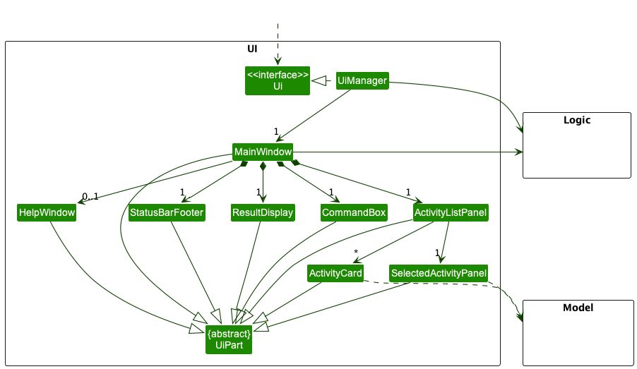

The UI consists of a `MainWindow` that is made up of parts e.g.`CommandBox`, `ResultDisplay`, `ActivityListPanel`, `StatusBarFooter` etc. All these, including the `MainWindow`, inherit from the abstract `UiPart` class which captures the commonalities between classes that represent parts of the visible GUI.

The `UI` component uses the JavaFx UI framework. The layout of these UI parts are defined in matching `.fxml` files that are in the `src/main/resources/view` folder. For example, the layout of the [`MainWindow`](https://github.com/AY2223S1-CS2103T-T12-3/tp/blob/master/src/main/java/hobbylist/ui/MainWindow.java) is specified in [`MainWindow.fxml`](https://github.com/AY2223S1-CS2103T-T12-3/tp/blob/master/src/main/resources/view/MainWindow.fxml)

The `UI` component,

* executes user commands using the `Logic` component.
* listens for changes to `Model` data so that the UI can be updated with the modified data.
* keeps a reference to the `Logic` component, because the `UI` relies on the `Logic` to execute commands.
* depends on some classes in the `Model` component, as it displays `Activity` object residing in the `Model`.

### Logic component

**API** : [`Logic.java`](https://github.com/AY2223S1-CS2103T-T12-3/tp/blob/master/src/main/java/hobbylist/logic/Logic.java)

Here's a (partial) class diagram of the `Logic` component:

How the `Logic` component works:
1. When `Logic` is called upon to execute a command, it uses the `HobbyListParser` class to parse the user command.
1. This results in a `Command` object (more precisely, an object of one of its subclasses e.g., `AddCommand`) which is executed by the `LogicManager`.
1. The command can communicate with the `Model` when it is executed (e.g. to add a activity).
1. The result of the command execution is encapsulated as a `CommandResult` object which is returned back from `Logic`.

The Sequence Diagram below illustrates the interactions within the `Logic` component for the `execute("delete 1")` API call.

:information_source: **Note:** The lifeline for `DeleteCommandParser` should end at the destroy marker (X) but due to a limitation of PlantUML, the lifeline reaches the end of diagram.

Here are the other classes in `Logic` (omitted from the class diagram above) that are used for parsing a user command:

How the parsing works:
* When called upon to parse a user command, the `HobbyListParser` class creates an `XYZCommandParser` (`XYZ` is a placeholder for the specific command name e.g., `AddCommandParser`) which uses the other classes shown above to parse the user command and create a `XYZCommand` object (e.g., `AddCommand`) which the `HobbyListParser` returns back as a `Command` object.
* All `XYZCommandParser` classes (e.g., `AddCommandParser`, `DeleteCommandParser`, ...) inherit from the `Parser` interface so that they can be treated similarly where possible e.g, during testing.

### Model component
**API** : [`Model.java`](https://github.com/AY2223S1-CS2103T-T12-3/tp/blob/master/src/main/java/hobbylist/model/Model.java)

The `Model` component,

* stores the activity list data i.e., all `Activity` objects (which are contained in a `UniqueActivityList` object).
* stores the currently 'selected' `Activity` objects (e.g., results of a search query) as a separate _filtered_ list which is exposed to outsiders as an unmodifiable `ObservableList<Activity>` that can be 'observed' e.g. the UI can be bound to this list so that the UI automatically updates when the data in the list change.
* stores a `UserPref` object that represents the user’s preferences. This is exposed to the outside as a `ReadOnlyUserPref` objects.
* does not depend on any of the other three components (as the `Model` represents data entities of the domain, they should make sense on their own without depending on other components)

:information_source: **Note:** An alternative (arguably, a more OOP) model is given below. It has a `Tag` list in the `HobbyList`, which `Activity` references. This allows `HobbyList` to only require one `Tag` object per unique tag, instead of each `Activity` needing their own `Tag` objects. 

### Storage component

**API** : [`Storage.java`](https://github.com/AY2223S1-CS2103T-T12-3/tp/blob/master/src/main/java/hobbylist/storage/Storage.java)

The `Storage` component,
* can save both activity list data and user preference data in json format, and read them back into corresponding objects.
* inherits from both `HobbyListStorage` and `UserPrefStorage`, which means it can be treated as either one (if only the functionality of only one is needed).
* depends on some classes in the `Model` component (because the `Storage` component's job is to save/retrieve objects that belong to the `Model`)

### Common classes

Classes used by multiple components are in the `hobbylist.commons` package.

--------------------------------------------------------------------------------------------------------------------

## **Implementation**

This section describes some noteworthy details on how certain features are implemented.

### Select an activity

#### Implementation

The following sequence diagram shows what happens when the user selects an activity by its `Index` from the activity list.

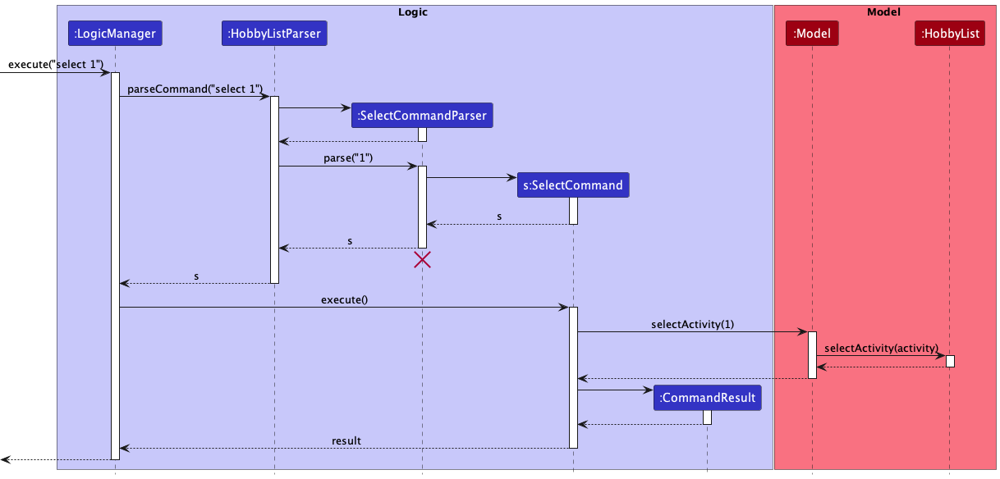

The activity with the given `Index` is selected and kept tracked by a listener of so that `SelectedActivityPanel` can be updated whenever there are changes to the currently selected activity.

The following sequence diagram shows what happens in the `UI` when the selected activity gets deleted.

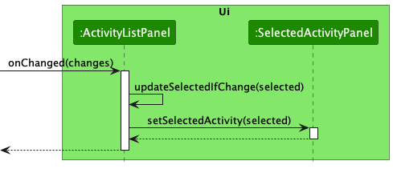

### Renaming commands

#### Implementation

Storing of renamed commands is facilitated by `AliasSettings`. It is an attribute of `UserPrefs`. It contains a string for each of the commands implemented. It extends `Serializable` so it can be converted into json for storage.

A new window, `EditAliasesWindow` is also added to provide a place to edit the names of all the commands.

The following sequence diagram shows what happens when the user saves a new set of command names.

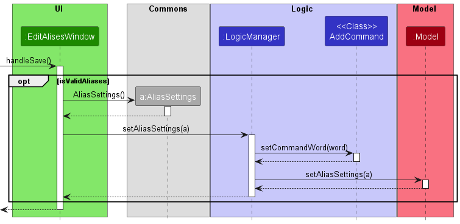

The command word for each command is updated and all future commands are parsed with the new command words.

The following sequence diagram shows what happens in the `model` component when `setAliasSettings()` is called.

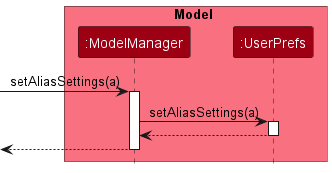

#### Design Considerations

**Aspect: How to store the list of command names:**

* **Alternative 1 (current choice):** Save it in a variable corresponding to the command.
  * Pros: Easy to implement.
  * Cons: Hard to extend when new commands are added.
* **Alternative 2:** Use a list of commands and dynamically generate the fields in `EditAliasesWindow` and store the changed command names using a `HashMap`.
  * Pros: Easy to extend.
  * Cons: Harder to implement.

### Setting activity status 

The user can set status for an activity by including `s/STATUS` when performing the add or edit command.
 * `s/STATUS` only accepts **UPCOMING**, **ONGOING** or **COMPLETED** as STATUS (case-insensitive).
 * If STATUS is not specified when performing the add command, it will be displayed as **STATUS: NONE** by default.
 * Different status will have different coloured tag when displayed in the list of activities.

The addition of the status field allows the user to categorise their activities into different status. This way it will be easier
for the user to check their upcoming, ongoing or completed activities so that they can properly track their progress and plan their schedule.

#### Implementation

Similar to the existing `Name` field, the implementation of the `Status` field is achieved by creating a Status class and letting the Activity class take in a status object.

The following is a scenario of when the user wants to add an activity named "Star Wars", with the description "movie"
and with a status of "upcoming".

1. `execute("add n/Star Wars d/movie s/upcoming")` of `LogicManager` calls the `parseCommand` method of `HobbyListParser`
2. `parseCommand("add n/Star Wars d/movie s/upcoming")` parses the string `"add n/Star Wars d/movie s/upcoming"` and calls the `parse` method of `AddCommandParser`
3. The `parse` method will check if the name, description and status provided are valid. If it is valid,
it returns a new `AddCommand` object.
4. The overridden `execute` method from AddCommand is then called which adds the created activity object to the model and return
a new `CommandResult` object.

The following sequence diagram shows what happens when the user perform `add n/Star Wars d/movie s/upcoming`.

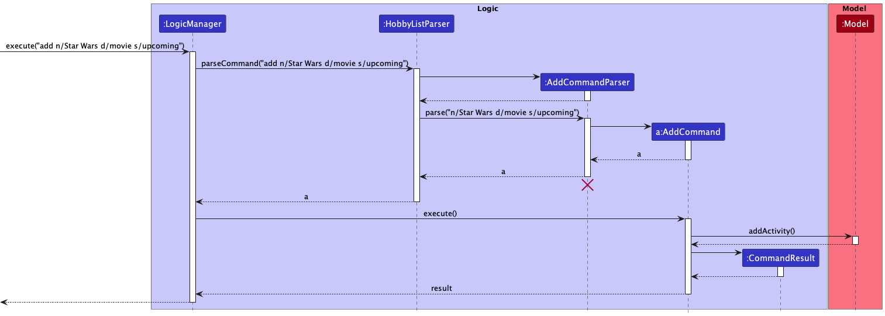

### Rating and reviewing an activity

#### Implementation

The command is parsed and a `RateCommand` is created. Executing the `RateCommand` then creates a new `activityWithRating` Activity with 
the rate and/or review fields and set the old activity to `activityWithRating`.

The following sequence diagram shows what happens when the user uses a rate command.

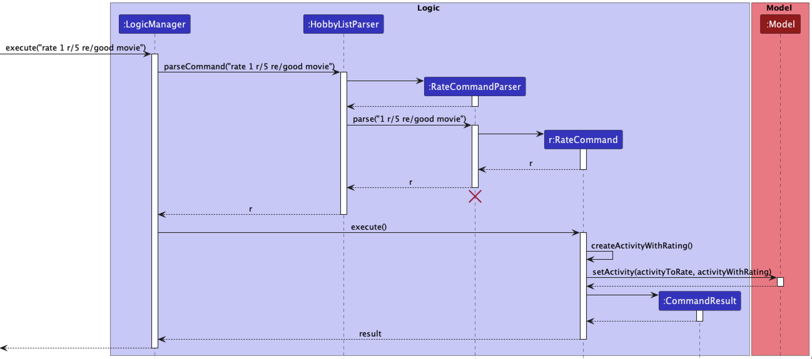

### Setting Themes

#### Implementation

Changing themes is handled by 5 different methods. Each comes with a unique css file.

Each css file applies a set of different stylesheets to `MainWindow`, `ActivityCard`, `ActivityListPanel`, `CommandBox` and `ResultDisplay`.

The following sequence diagram shows what happens when the user decide to change a theme. Take change the theme to Dark as an example.

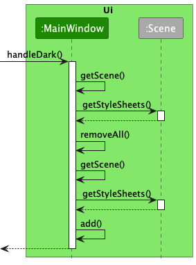

#### Design Considerations

**Aspect:** How to prevent adding multiple stylesheets to the scene:

**Current choice:** Remove all stylesheets and then add a new one.

**Aspect:** How to keep the user-preferred settings:

**Current choice:** Save it as a variable in MainWindow class and load it when next time user start the app.

### \[Proposed\] Undo/redo feature

#### Proposed Implementation

The proposed undo/redo mechanism is facilitated by `VersionedHobbyList`. It extends `HobbyList` with an undo/redo history, stored internally as an `hobbyListStateList` and `currentStatePointer`. Additionally, it implements the following operations:

* `VersionedHobbyList#commit()` — Saves the current activity list state in its history.
* `VersionedHobbyList#undo()` — Restores the previous activity list state from its history.
* `VersionedHobbyList#redo()` — Restores a previously undone activity list state from its history.

These operations are exposed in the `Model` interface as `Model#commitHobbyList()`, `Model#undoHobbyList()` and `Model#redoHobbyList()` respectively.

Given below is an example usage scenario and how the undo/redo mechanism behaves at each step.

Step 1. The user launches the application for the first time. The `VersionedHobbyList` will be initialized with the initial activity list state, and the `currentStatePointer` pointing to that single activity list state.

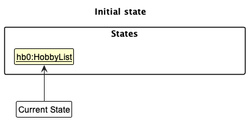

Step 2. The user executes `delete 5` command to delete the 5th activity in the activity list. The `delete` command calls `Model#commitHobbyList()`, causing the modified state of the activity list after the `delete 5` command executes to be saved in the `hobbyListStateList`, and the `currentStatePointer` is shifted to the newly inserted activity list state.

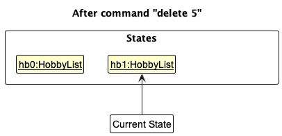

Step 3. The user executes `add n/Run 42km …​` to add a new activity. The `add` command also calls `Model#commitHobbyList()`, causing another modified activity list state to be saved into the `hobbyListStateList`.

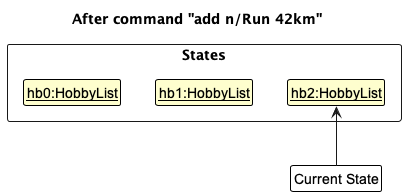

:information_source: **Note:** If a command fails its execution, it will not call `Model#commitHobbyList()`, so the activity list state will not be saved into the `hobbyListStateList`.

Step 4. The user now decides that adding the activity was a mistake, and decides to undo that action by executing the `undo` command. The `undo` command will call `Model#undoHobbyList()`, which will shift the `currentStatePointer` once to the left, pointing it to the previous activity list state, and restores the activity list to that state.

:information_source: **Note:** If the `currentStatePointer` is at index 0, pointing to the initial HobbyList state, then there are no previous HobbyList states to restore. The `undo` command uses `Model#canUndoHobbyList()` to check if this is the case. If so, it will return an error to the user rather
than attempting to perform the undo.

The following sequence diagram shows how the undo operation works:

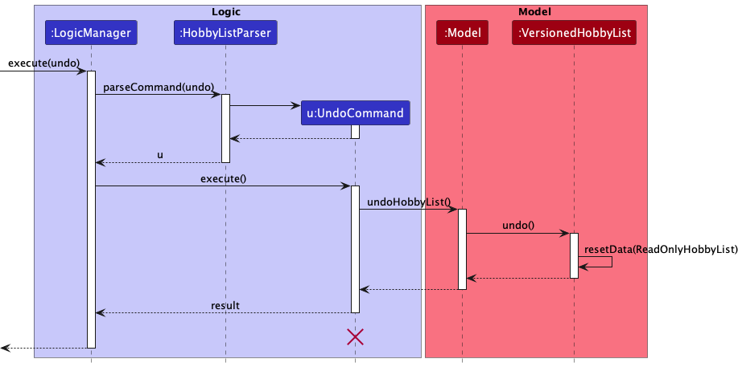

:information_source: **Note:** The lifeline for `UndoCommand` should end at the destroy marker (X) but due to a limitation of PlantUML, the lifeline reaches the end of diagram.

The `redo` command does the opposite — it calls `Model#redoHobbyList()`, which shifts the `currentStatePointer` once to the right, pointing to the previously undone state, and restores the activity list to that state.

:information_source: **Note:** If the `currentStatePointer` is at index `hobbyListStateList.size() - 1`, pointing to the latest activity list state, then there are no undone HobbyList states to restore. The `redo` command uses `Model#canRedoHobbyList()` to check if this is the case. If so, it will return an error to the user rather than attempting to perform the redo.

Step 5. The user then decides to execute the command `list`. Commands that do not modify the activity list, such as `list`, will usually not call `Model#commitHobbyList()`, `Model#undoHobbyList()` or `Model#redoHobbyList()`. Thus, the `hobbyListStateList` remains unchanged.

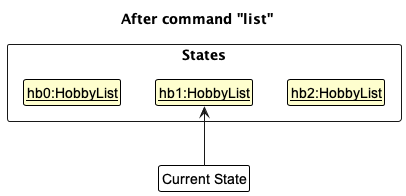

Step 6. The user executes `clear`, which calls `Model#commitHobbyList()`. Since the `currentStatePointer` is not pointing at the end of the `hobbyListStateList`, all activity list states after the `currentStatePointer` will be purged. Reason: It no longer makes sense to redo the `add n/Run 42km …​` command. This is the behavior that most modern desktop applications follow.

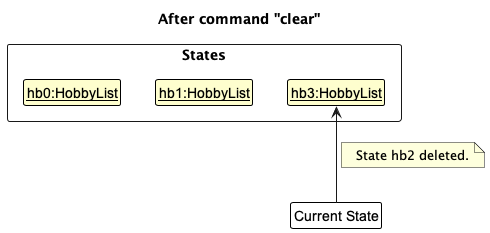

The following activity diagram summarizes what happens when a user executes a new command:

#### Design considerations:

**Aspect: How undo & redo executes:**

* **Alternative 1 (current choice):** Saves the entire activity list.
    * Pros: Easy to implement.
    * Cons: May have performance issues in terms of memory usage.

* **Alternative 2:** Individual command knows how to undo/redo by
  itself.
    * Pros: Will use less memory (e.g. for `delete`, just save the activity being deleted).
    * Cons: We must ensure that the implementation of each individual command are correct.

_{more aspects and alternatives to be added}_

--------------------------------------------------------------------------------------------------------------------

## **Documentation, logging, testing, configuration, dev-ops**

* [Documentation guide](Documentation.md)
* [Testing guide](Testing.md)
* [Logging guide](Logging.md)
* [Configuration guide](Configuration.md)
* [DevOps guide](DevOps.md)

--------------------------------------------------------------------------------------------------------------------

## **Appendix: Requirements**

### Product scope

**Target user profile**:

* need to store all the past activities that are done
* keep track of ongoing and future activities
* keep record of time of certain event
* organize all the activities for better look up
* prefer desktop apps over other types
* can type fast
* prefers typing to mouse interactions
* is reasonably comfortable using CLI apps

**Value proposition**: Provide a place for our users to store all the activities that are done,
ongoing or todo and organises it for them so it will be easier to trace back using specific activities.
Mainly CLI with many shortcuts to benefit people who type fast.

### User stories

Priorities: High (must have) - `* * *`, Medium (nice to have) - `* *`, Low (unlikely to have) - `*`

| Priority | As a …          | I want to …                                                        | So that I can…                                 |
|----------|-----------------|--------------------------------------------------------------------|------------------------------------------------|
| `* * *`  | user            | add activity                                                       | track my activities                            |
| `* * *`  | user            | delete activity                                                    | make mistakes                                  |
| `* * *`  | user            | view activities                                                    | look at what I have done                       |
| `* *`    | busy CS student | quickly write commands                                             | save time adding entries                       |
| `* *`    | busy CS student | add date to an activity                                            | keep the timeline of events in life clear      |
| `*`      | busy CS student | find activities in certain time period                             | manage different timeline of activities        |
| `* *`    | new user        | type "help" for help                                               | try the commands and use the app               |
| `* *`    | new user        | clear all activities                                               | quickly clear the sample data                  |
| `* *`    | new user        | see sample data                                                    | get to know how the app works                  |
| `* *`    | user            | tag an activity with a type                                        | know what type of activity it is               |
| `* *`    | user            | change the appearance of the app                                   | have better experience when looking through    |
| `* *`    | user            | add an activity description                                        | know what the activity is about                |
| `*`      | long time user  | use shortcuts for commands                                         | enter commands faster                          |
| `*`      | food enthusiast | review restaurants                                                 | note down my opinions of the restaurant        |
| `*`      | food enthusiast | rate restaurants                                                   | note down my opinions of the restaurant        |
| `*`      | food enthusiast | find restaurants with certain rate                                 | quickly choose a restaurant to go              |
| `*`      | food enthusiast | find restaurants with rate higher than or equal to a certain value | choose some restaurants to recommend to others |
| `*`      | gym user        | keep track of dates of activities                                  | record when I did the activity                 |
| `*`      | long time user  | search activities with keywords                                    | quickly find certain activity                  |

*{More to be added}*

### Use cases

(For all use cases below, the **System** is the `HobbyList` and the **Actor** is the `user`, unless specified otherwise)

**Use case: UC01 - Add an activity**

**MSS**

1. User requests to add an activity to the list
2. HobbyList adds that activity to the list and shows a confirmed message

   Use case ends.

**Extensions**

* 1a. The activity is already existed.

    * 1a1. HobbyList shows a message to announce the user.

      Use case ends.

**Use case: UC02 - List all activities**

**MSS**

1.  User requests to see all activities
2.  HobbyList shows a list of activities

    Use case ends.

**Extensions**

* 2a. The list is empty.
    * 2a1. HobbyList shows a message to announce the user.

      Use case ends.

**Use case: UC03 - Delete an activity**

**MSS**

1.  User requests to list out all activities
2.  HobbyList shows a list of activities
3.  User requests to delete a specific activity in the list
4.  HobbyList deletes the activity

    Use case ends.

**Extensions**

* 2a. The list is empty.

  Use case ends.

* 3a. The given index is invalid.

    * 3a1. HobbyList shows an error message.

      Use case resumes at step 2.

**Use case: UC04 - Find activities in a certain time period**

**MSS**

1. User find activities on a certain date/in a certain month/year.
2. HobbyList shows all the activities located in the required period.

    Use case ends.

**Use case: UC05 - Find activities whose rating are greater or equal than certain value**

**MSS**

1. User find activities with rates greater or equal than certain value.
2. HobbyList shows activities with rates above certain value.

    Use case ends.

**Use case: UC06 - Add date of an activity**

**MSS**

1.  User add an activity with date
2.  HobbyList shows the date in the activity card

    Use case ends.

**Extensions**

* 1a. The date format is wrong
    * 1a1. HobbyList shows a message about the right format.
  
* 1b. There are multiple dates in the add command
    * 1b1. HobbyList will save the last date typed in.
  
      Use case ends.

**Use case: UC07 - Edit date of an activity**

**MSS**

1.  User edit an activity with new date 
2.  HobbyList update the date in the activity card

    Use case ends.

**Extensions**

* 1a. The edit content of date is empty
    * 1a1. HobbyList delete the original date.

      Use case ends.

**Use case: UC08 - Select an activity to display its details**

**MSS**

1. User select an activity by its index
2. HobbyList show all the details of the selected activity, including name, description, tags, date, status, rating, review

   Use case ends.

**Extensions**

* 1a. The given index is invalid
    * 1a1. HobbyList shows an error message.
      
         Use case resumes at step 1.
    
**Use case: UC09 - Changing command names**

**MSS**
1. User requests to change command names
2. HobbyList prompts the user for changes
3. User sets the changes and confirms
4. HobbyList saves the changes

   Use case ends.

**Extensions**
* 2a. User enters invalid command names
    * 2a1. HobbyList alerts user of the error

      Use case resumes at step 2.

**Use case: UC10 - Changing to a different theme**

**MSS**
1. User change a theme
2. HobbyList show the target theme
3. HobbyList saves the change as default ui for next time when user open the app.

   Use case ends.

### Non-Functional Requirements

1.  Should work on any _mainstream OS_ as long as it has Java `11` or above installed.
2.  Should be able to hold up to 1000 activities without a noticeable sluggishness in performance for typical usage.
3.  A user with above average typing speed for regular English text (i.e. not code, not system admin commands) should be able to accomplish most of the tasks faster using commands than using the mouse.

*{More to be added}*

### Glossary

| Terms              | Meaning                                                                                             |
|--------------------|-----------------------------------------------------------------------------------------------------|
| **Mainstream OS**  | Windows, Linux, Unix, OS-X                                                                          |
| **GUI**            | A graphical user interface, which is the visual display you see when using HobbyList                |
| **Index**          | A number that you can use to refer to a particular activity                                         |
| **Tag**            | A word (eg. `Entertainment`, `Sport`) that you can attach to the activities to easily identify them |
| **Date**           | A yyyy-mm-dd format date (eg. `2002-02-19`) that you can attach to the activities for matching date |

--------------------------------------------------------------------------------------------------------------------

## **Appendix: Instructions for manual testing**

Given below are instructions to test the app manually.

:information_source: **Note:** These instructions only provide a starting point for testers to work on;
testers are expected to do more *exploratory* testing.

### Launch and shutdown

1. Initial launch

    1. Download the jar file and copy into an empty folder

    1. Double-click the jar file Expected: Shows the GUI with a set of sample contacts. The window size may not be optimum.

1. Saving window preferences

    1. Resize the window to an optimum size. Move the window to a different location. Close the window.

    1. Re-launch the app by double-clicking the jar file. 
       Expected: The most recent window size and location is retained.

1. _{ more test cases …​ }_

### Deleting a activity

1. Deleting a activity while all activities are being shown

    1. Prerequisites: List all activities using the `list` command. Multiple activities in the list.

    1. Test case: `delete 1` 
       Expected: First contact is deleted from the list. Details of the deleted contact shown in the status message. Timestamp in the status bar is updated.

    1. Test case: `delete 0` 
       Expected: No activity is deleted. Error details shown in the status message. Status bar remains the same.

    1. Other incorrect delete commands to try: `delete`, `delete x`, `...` (where x is larger than the list size) 
       Expected: Similar to previous.

1. _{ more test cases …​ }_

### Saving data

1. Dealing with missing/corrupted data files

    1. Test case: delete a name field in the save file.
       Expected: Save file gets wiped.

    2. Test case: set an activity's date to `test`.
       Expected: Save file gets wiped.

    3. Test case: set an activity's status to `test`.
        Expected: Save file gets wiped.

    4. Test case: set an activity's rating to `test`.
       Expected: Save file gets wiped.
