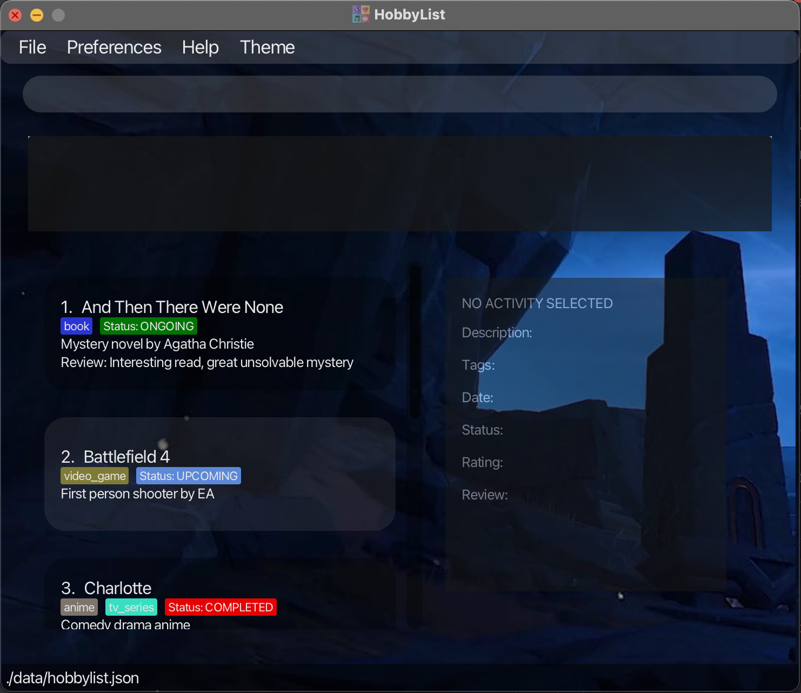

HobbyList is a **desktop app for managing hobby activities, optimized for use via a Command Line Interface** (CLI) while still having the benefits of a Graphical User Interface (GUI). If you can type fast, HobbyList can get your activity management tasks done faster than traditional GUI apps.

* Table of Contents
{:toc}

--------------------------------------------------------------------------------------------------------------------

## Quick start

1. Ensure you have Java `11` or above installed in your Computer.

1. Download the latest `hobbylist.jar` from [here](https://github.com/AY2223S1-CS2103T-T12-3/tp/releases).

1. Copy the file to the folder you want to use as the _home folder_ for your HobbyList.

1. Double-click the file to start the app. The GUI similar to the below should appear in a few seconds. Note how the app contains some sample data. 
   

1. Type the command in the command box and press Enter to execute it. 
   Some example commands you can try:

   * **`list`** : Lists all hobby activities in HobbyList.

   * **`add`**`n/Badminton d/play badminton [t/sport]` : Adds an hobby activity named `Badminton` to the list.

   * **`delete`**`3` : Deletes the 3rd hobby activity shown in the current list.
   
   * **`exit`** : Exits the app.

1. Refer to the [Features](#features) below for details of each command.

--------------------------------------------------------------------------------------------------------------------

## Features

**:information_source: Notes about the command format:** 

* Words in `UPPER_CASE` are the parameters to be supplied by the user. 
  e.g. in `add n/NAME`, `NAME` is a parameter which can be used as `add n/John Doe`.

* Items in square brackets are optional. 
  e.g `n/NAME [t/TAG]` can be used as `n/John Doe t/friend` or as `n/John Doe`.

* Items with `…`​ after them can be used multiple times including zero times. 
  e.g. `[t/TAG]…​` can be used as ` ` (i.e. 0 times), `t/friend`, `t/friend t/family` etc.

* Parameters can be in any order. 
  e.g. if the command specifies `n/NAME p/PHONE_NUMBER`, `p/PHONE_NUMBER n/NAME` is also acceptable.

* If a parameter is expected only once in the command but you specified it multiple times, only the last occurrence of the parameter will be taken. 
  e.g. if you specify `p/12341234 p/56785678`, only `p/56785678` will be taken.

* Extraneous parameters for commands that do not take in parameters (such as `help`, `list`, `exit` and `clear`) will be ignored. 
  e.g. if the command specifies `help 123`, it will be interpreted as `help`.

### Adding a hobby activity: `add`

Adds a hobby activity to HobbyList.

Format: `add n/NAME d/DESCRIPTION [t/TAG]`

Examples:
* `add n/Badminton d/play badminton [t/sport]`
* `add n/Pottery d/make pottery [t/art]`

### Listing all hobby activities : `list`

Shows a list of all hobby activities in HobbyList.

Format: `list`

### Deleting an activity : `delete`

Deletes a specified activity from HobbyList.

Format: `delete INDEX`

* Deletes the activity at the specified `INDEX`.
* The index refers to the index number shown in the displayed activity list.
* The index **must be a positive integer** 1, 2, 3, …​

### Exiting the program : `exit`

Exits the program.

Format: `exit`

### Saving the data

HobbyList data are saved in the hard disk automatically after any command that changes the data. There is no need to save manually.

### Editing the data file

HobbyList data are saved as a JSON file `[JAR file location]/data/hobbylist.json`. Advanced users are welcome to update data directly by editing that data file.

:exclamation: **Caution:**
If your changes to the data file makes its format invalid, AddressBook will discard all data and start with an empty data file at the next run.

--------------------------------------------------------------------------------------------------------------------

## FAQ

**Q**: How do I transfer my data to another Computer? 
**A**: Install the app in the other computer and overwrite the empty data file it creates with the file that contains the data of your previous HobbyList home folder.

--------------------------------------------------------------------------------------------------------------------

## Command summary

Action | Format
--------|------------------
**Add acitivity** | `add n/NAME d/DESCRIPTION [t/TAG]`
**Delete activity** | `delete INDEX`
**List all activities** | `list`
**Exit** | `exit`

