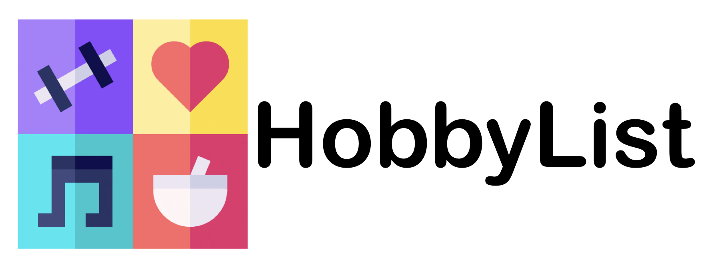
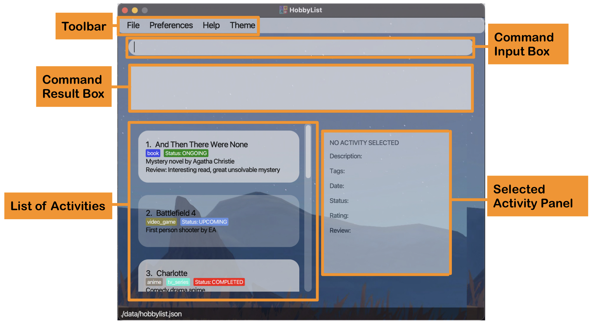
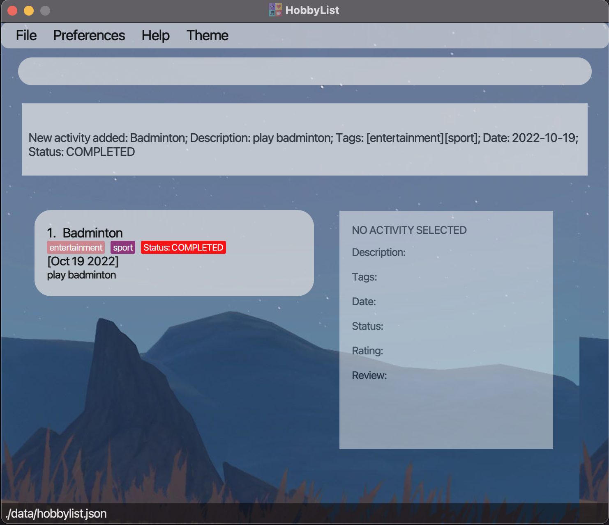
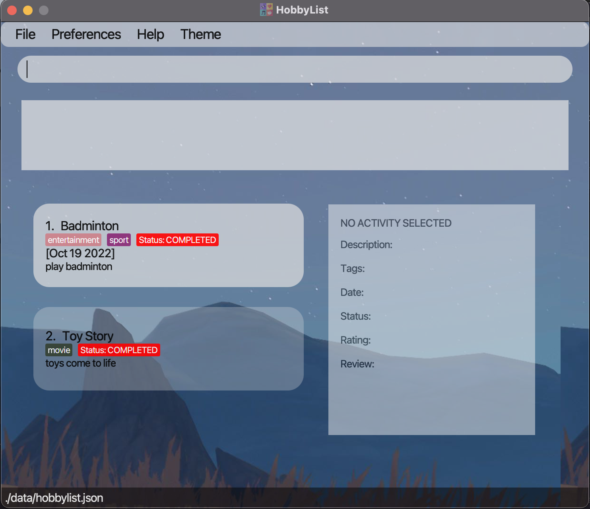
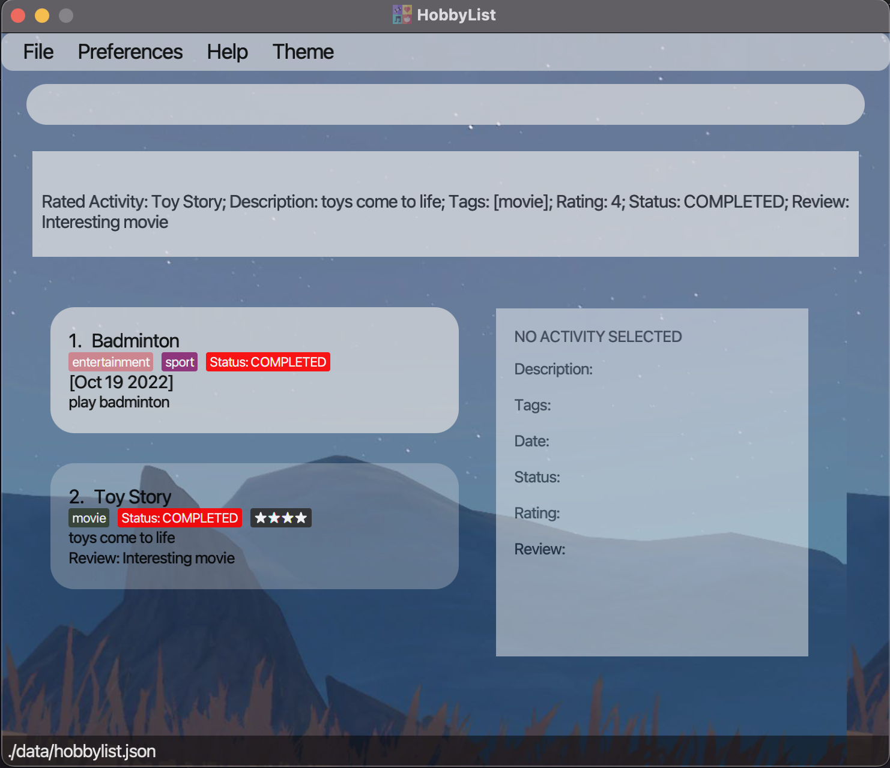
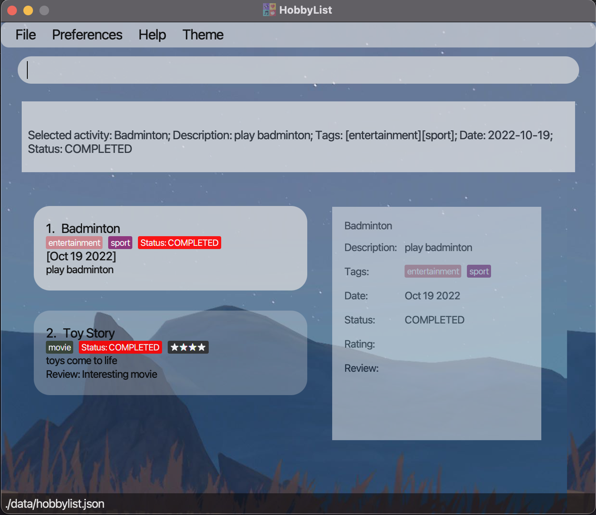
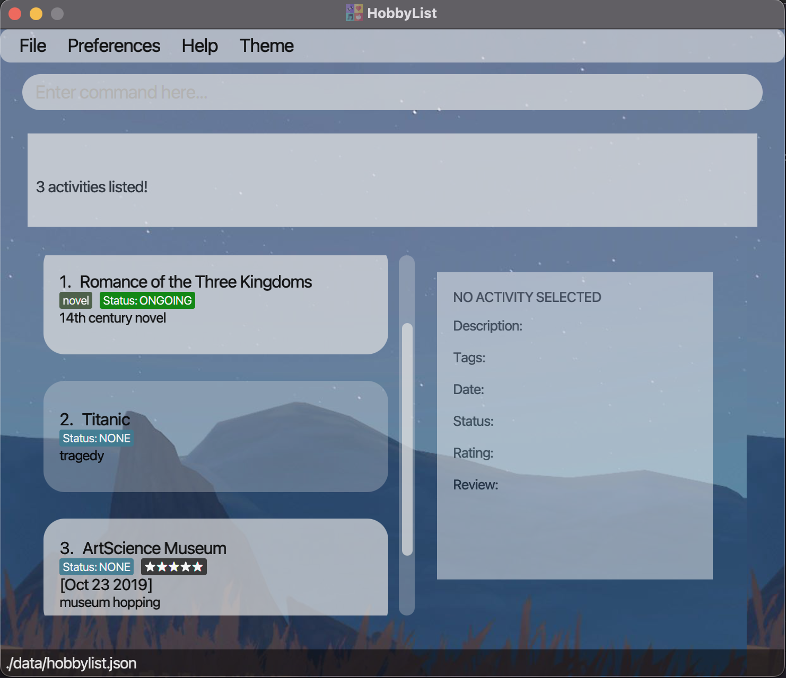
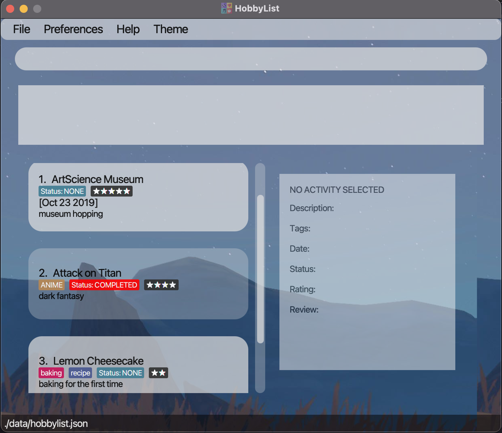
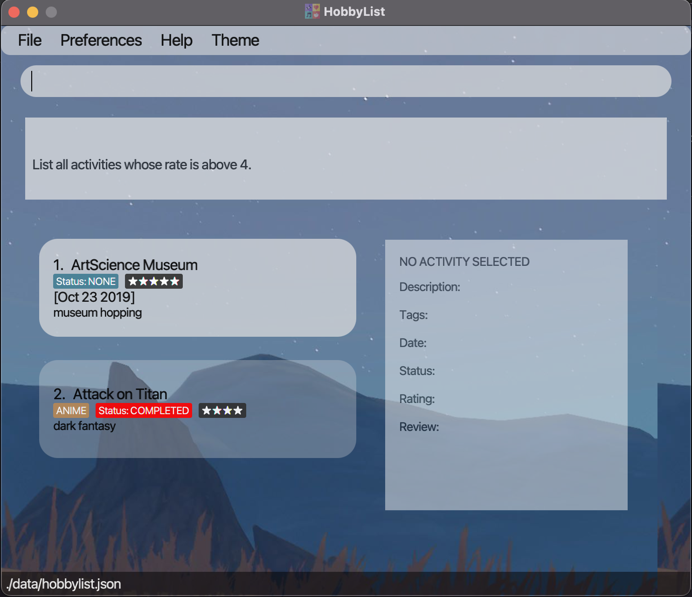

  * Table of Contents
  {:toc}

--------------------------------------------------------------------------------------------------------------------

## **1. Introduction**

### 1.1 What is HobbyList?
HobbyList is a **desktop app for students to manage their hobby activities, optimized for use via a Command Line Interface** (CLI) while still having the benefits of a Graphical User Interface (GUI). If you can type fast, HobbyList can get your activity management tasks done faster than traditional GUI apps.

If you prefer typing only and want to record your experiences with your hobby activities such as reading books or watching movies, HobbyList is the perfect app for you.

--------------------------------------------------------------------------------------------------------------------

## **2. About this User Guide**

### 2.1 What is this user guide for?
This user guide provides you with all the information required for you to become adept at using HobbyList. You will learn all the features that HobbyList has to offer and how to make use of them to the fullest to keep records of all your hobby activities. There are information on the basic commands such as [add](#51-adding-a-hobby-activity--add), [delete](#53-deleting-an-activity--delete), [list](#54-listing-all-hobby-activities--list) and [rate](#55-rating-an-activity-rate), and also advanced features such as [renaming command names](#514-renaming-the-commands).

### 2.2 How to use this user guide?

#### Table of contents
The [table of contents](#toc) is at the top of the page. From there, you can click on any of the sections to jump to it.

#### Quick start
If you want to **quick**ly get **start**ed with using HobbyList, you can read and follow the instructions in the [Quick start](#3-quick-start) section

#### Features
The [features](#5-features) section contains a list of all the features that HobbyList currently has. Within each feature, you can read up on how each feature is used and look at some examples.
The features are laid out with a short description, followed by the format of the command, then finally some examples with explanation on what they do.
This [information box](#command-info) provides information on understanding the command format while [this one](#what-is-an-activity) tells you what an activity is and what information is stored in one.

#### Special boxes
Throughout the entire user guide, there are special boxes like the ones below which give you additional information.

:information_source: **Additional information:** 

Boxes such as this one with an information symbol :information_source: are used to provide additional information which you should read if you want to use the related features or understand the user guide fully.

:exclamation: **Caution:** 

Boxes such as this one with an exclamation mark :exclamation: are used to warn you about things that you should take note of, as certain actions may cause drastic consequences that are not intended by you.

:bulb: **Tip:** 

Boxes such as this one with a light bulb :bulb: are used to provide some tips which you can make use of to improve your experience with HobbyList.

#### Hyperlinks
Throughout this user guide, there are hyperlinks which you can click on to get more information about something. To go back to where you were, you can use the `back` button on your browser.

#### Command summary
If you are already familiar with the features of HobbyList and just want a quick summary of the commands, you can refer to this [command summary table](#8-command-summary).

#### Glossary
If you encounter an unfamiliar technical term, you can look it up in the glossary at the bottom, you can refer to this [glossary](#9-glossary)

--------------------------------------------------------------------------------------------------------------------

## **3. Quick start**

1. Ensure you have Java `11` or above installed in your Computer.

2. Download the latest `hobbylist.jar` from [here](https://github.com/AY2223S1-CS2103T-T12-3/tp/releases).

3. Copy the file to the folder you want to use as the _home folder_ for your HobbyList.

4. Double-click the file to start the app. The default GUI similar to the one below should appear in a few seconds. You can see that the app contains some sample data for you to play around with. 
   
_
Figure 1: HobbyList's default UI
_
5. Type the command in the command box and press Enter to execute it. 
   Some example commands you can try:

    * **`list`** : Lists all hobby activities in HobbyList.

    * **`add`**`n/42km run d/NUS Run event [t/sport] [date/2022-09-30]` : Adds a hobby activity named `42km run` to the list.
    
    * **`delete`**`3` : Deletes the 3rd hobby activity shown in the current list.

    * **`find`**`keyword/1973-03` : Finds activities that contain the keyword or located in March 1973.

    * **`exit`** : Exits the app.

6. Click the button located in the top left corner to execute certain task. 
   Some example buttons you can try:
    * **`File`** : To find the exit button.

    * **`Preference`** : To set command words according to user's preference.
    
    * **`Help`** : To open a pop-up window containing more helping information.

    * **`Theme`** : To change different appearance of the app.

7. Refer to the [Features](#5-features) below for details of each command.

--------------------------------------------------------------------------------------------------------------------

## **4. HobbyList User Interface**

Refer to Figure 2 below to get yourself familiar with the user interface! 

_Figure 2: Annotated GUI of HobbyList_
{: style="text-align: center;"}

| Section                 | Description                                                                                                                                    |
|-------------------------|------------------------------------------------------------------------------------------------------------------------------------------------|
| Toolbar                 | Provides functionality for you to exit the application, rename commands, access the help page and change the appearance of the user interface. |
| Command Input Box       | This is where you can type and perform the different commands available.                                                                       |
| Command Result Box      | This box displays information related to the commands you execute.                                                                             |
| List of Activites       | This section displays the activity list and can display a subset of activities depending on the command you perform.                           |
| Selected Activity Panel | This box displays an activity's information after you perform the `select` command.                                                            |

--------------------------------------------------------------------------------------------------------------------

## **5. Features**

**:information_source: Notes about the command format:** 

* Words in `UPPER_CASE` are the parameters to be supplied by the user. 
  e.g. in `add n/NAME`, `NAME` is a parameter which can be used as `add n/42km run`.

* Items in square brackets are optional. 
  e.g. `n/NAME [t/TAG] [date/DATE] [s/STATUS] ` can be used as `n/42km run t/sport` or as `n/42km run`.

* Items with `…`​ after them can be used multiple times including zero times. 
  e.g. `[t/TAG]…​` can be used as ` ` (i.e. 0 times), `t/sport`, `t/sport t/cardio` etc.

* A parameter is something you add after the command name to provide more information to the command.

* Parameters can be in any order. 
  e.g. if the command specifies `n/NAME d/DESCRIPTION`, `d/DESCRIPTION n/NAME` is also acceptable.

* If a parameter is expected only once in the command, but you specified it multiple times, only the last occurrence of the parameter will be taken. 
  e.g. if you specify `d/NUS Run d/NUS Biathlon`, only `d/NUS Biathlon` will be taken.

* The date format for `[date/DATE]` should be `yyyy-mm-dd`. e.g. `date/2022-12-25`.

* Extraneous parameters for commands that do not take in parameters (such as `help`, `list`, `exit` and `clear`) will be ignored. 
  e.g. if the command specifies `help 123`, it will be interpreted as `help`.

### 5.1 Adding a hobby activity : `add`

You can add an activity to HobbyList using this command.

> Format: `add n/NAME d/DESCRIPTION [t/TAG]... [date/DATE] [s/STATUS]`

:information_source: **Additional information for `add`:** 

* `[t/TAG]...` only accepts alphanumeric with underscores and can only be at most 15 characters long.
* `[date/DATE]` only accepts date with a format of **yyyy-mm-dd** with the year greater than 0.
* `[s/STATUS]` only accepts **UPCOMING**, **ONGOING** or **COMPLETED** as STATUS. e.g. `s/ongoing`(case-insensitive).
* If `STATUS` is not specified, it will be displayed as **Status: NONE** by default.
* If multiple dates or status are detected, the last one will be taken to add. But any number of tags will be accepted and added.

Examples:
* `add n/42km run d/NUS Run event t/sport`

  *Adds an activity with the name "42km run" with a description "NUS Run event" and with a tag "sport".*
  
* `add n/Badminton d/play badminton t/sport t/entertainment date/2022-10-19 s/completed`

  *Adds an activity with the name "Badminton", description "play badminton", tags "sport" and "entertainment", date "2022-10-19" and status "COMPLETED".*

_Figure 3: New activity added after running `add n/Badminton d/play badminton t/sport t/entertainment date/2022-10-19 s/completed`_
{: style="text-align: center;"}

:information_source: **What is an activity?** 

Every entry in HobbyList is an activity. Each activity contains the fields below.
* **Name**: What the activity is called. _Compulsory_.
* **Description**: What the activity is about. _Compulsory_.
* **Tags**: What type of activity it is. Helps you to organise your activities. For example, you can have different activities tagged "book", "movie" or "recipe". Each activity can have multiple tags. _Optional_.
* **Date**: When the activity was/will be done. Currently, each activity can only have one date, which you can set it to be the starting date, the ending date, or anything you like. _Optional_.
* **Status**: Whether the activity is upcoming, ongoing or completed. _Optional_.
* **Rating**: How good the activity is to you, on a scale of 1 to 5. _Optional_.
* **Review**: Your feelings about the activity after completing it. _Optional_.

### 5.2 Editing an activity : `edit`

You can edit an activity already in HobbyList using this command.

> Format: `edit INDEX [n/NAME] [d/DESCRIPTION] [t/TAGS]... [date/DATE] [s/STATUS]`

:information_source: **Additional information for `edit`:** 

* Edits the activity at the specified `INDEX`. The index refers to the index number shown in the displayed activity list. The `INDEX` **must be a positive integer** 1, 2, 3, …
* At least **one** of the optional fields must be provided.
* Existing values will be updated to the input values.
* When editing tags, the existing tags of the activity will be removed i.e. adding of tags is not cumulative.
* You can remove all the activity's tags by typing `t/` without specifying any tags after it.
* You can remove the date by typing `date/` without specifying any date after it.
* `[s/STATUS]` only accepts `UPCOMING`, `ONGOING` or `COMPLETED` (case-insensitive) as `STATUS`. e.g. `s/ongoing`.

Examples:

* `edit 1 n/A Clash of Kings d/Epic fantasy novel by George R. R. Martin.`

  *Edits the name and description of the first activity to be `A Clash of Kings` and `Epic fantasy novel by George R. R. Martin.` respectively.*

* `edit 2 date/2022-10-21 t/`

  *Removes the tags of the second activity and sets the date to `2022-10-21`.*

* `edit 3 s/completed`

  *Sets the status of the third activity to `COMPLETED`.*

### 5.3 Deleting an activity : `delete`

You can delete an activity from HobbyList using this command.

> Format: `delete INDEX`

:information_source: **Additional information for `delete`:** 

* Deletes the activity at the specified `INDEX`.
* The index refers to the index number shown in the displayed activity list.
* The index **must be a positive integer** 1, 2, 3, …​

Example: 

* `delete 1`
  *Deletes the first activity currently displayed in HobbyList.*

:exclamation: **Caution:** 

The `delete` command is final and cannot be undone. To prevent regrets, you might want to back up your save file which can be found in the `data` folder which is in the same folder as your HobbyList.jar file.

### 5.4 Listing all hobby activities : `list`

You can view all the activities you have in HobbyList using this command.

> Format: `list`

Example:

* `list`

  *Shows all the activities in HobbyList.*

### 5.5 Rating an activity: `rate`

You can add a rating and optionally write a review for an activity in the HobbyList using this command.

> Format: `rate INDEX r/RATING [re/REVIEW]`

:information_source: **Additional information for `rate`:** 

* The `INDEX` refers to the index number shown in the displayed activity list.
* The `INDEX` **must be a positive integer** 1, 2, 3, …​
* `RATING` only accepts integer numbers from 1 to 5 (inclusive).
* `REVIEW` accepts both alphanumeric and special symbols.

Examples:
* `rate 1 r/2`

  *Rates the first activity to be 2 out of 5 stars.*

* `rate 2 r/4 re/Interesting movie`

*Rates the second activity to be 4 out of 5 stars and gives it a review of `Interesting movie`.*

_Figure 4: List of activities before running the `rate` command_
{: style="text-align: center;"}

_Figure 5: List of activities after running `rate 2 r/4 re/Interesting movie`_
{: style="text-align: center;"}

  
### 5.6 Selecting an activity: `select`

You can display all details of the selected activity from HobbyList on the selected activity panel. This allows you to read the descriptions or reviews that are too long to display in the list.

> Format: `select INDEX`

:information_source: **Additional information for `select`:** 

* The `INDEX` refers to the index number shown in the displayed activity list.
* The `INDEX` **must be a positive integer** 1, 2, 3, …​

Example: 
* `select 1`

  *Displays the first activity in the selected activity panel.*

_Figure 6: Details of the selected activity is now displayed after running `select 1`_
{: style="text-align: center;"}

### 5.7 Finding activities: `find`

You can show a list of all hobby activities which contain any of the specified keywords using this command.

> Format: `find KEYWORDS`

:information_source: **Additional information for `find`:** 

* The `KEYWORDS` are case-insensitive.
* Each keyword in `KEYWORDS` is a string of characters separated by spaces.
* All activities with names or description containing at least one keyword would be displayed.
* Only one of the keywords can be in the form of `date/DATE` to show activities with the specified date.
* The date in `date/DATE` can be in the form of `yyyy`, `yyyy-mm`, or `yyyy-mm-dd`.
* Only one of the keywords can be in the form of `rate/RATING`to show activities with the specified rating.
* The rating has to be an integer from 1 to 5.

Examples:
* `find horror comedy`

  *Finds all activities with a name or description containing `horror` or `comedy` or both.*

* `find sleep date/2020-12`

  *Finds all activities with a name or description containing `sleep`, or with a date in December 2020.*

* `find rate/1 date/2021`

  *Finds all activities with a rating of 1 or with a date in the year 2021.*

* `find romance tragedy rate/5 date/2019-10-23`

  *Finds all activities with a name or description containing `romance` or `tragedy` or both, or with a rating of 5, or with a date of 23 October 2019.*

_Figure 7: Filtered list of activities after running `find romance tragedy rate/5 date/2019-10-23`_
{: style="text-align: center;"}

### 5.8 Finding activities with tags : `findTag`

You can show a list of all activities with tags matching the ones specified using this command.

> Format: `findTag KEYWORDS`

:information_source: **Additional information for `findTag`:** 

* All activities with any tag matching any of the `KEYWORDS` are shown.
* The `KEYWORDS` are case-sensitive.

Examples:
* `findTag book`

  *Shows all activities with a `book` tag. These activities may have other tags too.*

* `findTag ANIME recipe`

  *Shows all activities with a `ANIME` or `recipe` tag. These activities may have only one of the two tags, other tags, or both of the tags.*

### 5.9 Finding activities with status: `findStatus`

You can show a list of all activities with status matching the status specified using this command.

> Format: `findStatus STATUS`

:information_source: **Additional information for `findStatus`:** 

* The feature only works with the `STATUS` being **UPCOMING**, **ONGOING** or **COMPLETED** (case-insensitive).
* If input `STATUS` is different from the three statuses above, it is treated as **NONE** and HobbyList shows all the activities with a status of **NONE**.

Examples:
* `findStatus COMPLETED`

  *Shows a list of activities with a status of `COMPLETED`.*

* `findStatus ongoing`

  *Shows a list of activities with a status of `ONGOING`.*

* `findStatus uPComINg`

  *Shows a list of activities with a status of `UPCOMING`.*

### 5.10 Finding activities with ratings above a certain value : `r/above`

You can show a list of all activities whose rating value is greater or equal than the required value using this command.

> Format: `r/above VALUE`

:information_source: **Additional information for `r/above`:** 

* `VALUE` only accepts integer numbers from 1 to 5 (inclusive).

Example: 
* `r/above 4`

  *Shows a list of all activities with a rating greater than or equal to 4.*

_Figure 8: List of three activities with rating value of 5, 4 and 2 respectively_
{: style="text-align: center;"}

_Figure 9: Filtered list of activities after running `r/above 4`_
{: style="text-align: center;"}

### 5.11 Getting help : `help`

You can get a message explaining how to access the help page using this command.

> Format: `help`

Example:
* `help`

  *Gets a window showing a link to this user guide.*

### 5.12 Deleting all activities: `clear`

You can delete all activities from HobbyList using this command.

> Format: `clear`

Example:
* `clear`

  *Removes all activities from HobbyList.*

:exclamation: **Caution:** 

The `clear` command is final and cannot be undone. To prevent regrets, you might want to back up your save file which can be found in the `data` folder which is in the same folder as your HobbyList.jar file.

:bulb: **Tip:** 

You might want to [rename](#514-renaming-the-commands) the `clear` command into something long so that you will not enter it accidentally and lose all your data.

### 5.13 Exiting the program : `exit`

You can exit the program using this command. Alternatively, you can close the window.

> Format: `exit`

Example:
* `exit`

  *Exits HobbyList.*

### 5.14 Renaming the commands

If you do not like the names of the command, you can select `preferences` in the menu bar and `edit aliases` to rename any of the commands. You can rename the commands into anything, as long as they are not exactly the same, and contains no whitespaces.

:bulb: **Tip:** 

If you do not want to use your mouse, you can press the `F2` key to open the window, and switch fields to edit by pressing the `tab` key. Pressing `enter` while any field is in focus will save and close your settings.

If you really want to, you can shorten the commands to a single character to speed up typing commands, like the example below:

### 5.15 Changing appearance of the user interface.

If you do not like the current appearance of the theme. You can change it by clicking `Theme` in the menu bar and select different themes.

When you open the app next time, the default theme will be the last theme that you used.

--------------------------------------------------------------------------------------------------------------------

## **6. Managing data**

### 6.1 Saving the data

HobbyList data are saved in the hard disk automatically after any command that changes the data. There is no need to save manually.

### 6.2 Editing the data file

HobbyList data are saved as a JSON file `[JAR file location]/data/hobbylist.json`. Advanced users are welcome to update data directly by editing that data file.

:exclamation: **Caution:**
If your changes to the data file makes its format invalid, HobbyList will discard all data and start with an empty data file at the next run.

--------------------------------------------------------------------------------------------------------------------

## **7. FAQ**

**Q**: How do I transfer my data to another computer? 
**A**: Install the app in the other computer and overwrite the empty data file it creates with the file that contains the data of your previous HobbyList home folder.

--------------------------------------------------------------------------------------------------------------------

## **8. Command summary**

| Action                            | Format                                                                   | Examples                                                                                                                                               |
|-----------------------------------|--------------------------------------------------------------------------|--------------------------------------------------------------------------------------------------------------------------------------------------------|
| **Add activity**                  | `add n/NAME d/DESCRIPTION [t/TAG]... [date/DATE] [s/STATUS]`             | `add n/poutine d/at some place t/food date/2022-09-25 s/completed`                                                                                     |
| **Edit activity**                 | `edit INDEX [n/NAME] [d/DESCRIPTION] [t/TAGS]... [date/DATE] [s/STATUS]` | `edit 1 n/Bukit Timah Nature Reserve d/3 hour hike t/hike date/2022-08-17 s/completed`                                                                 |
| **Delete activity**               | `delete INDEX`                                                           | `delete 3`                                                                                                                                             |
| **List activities**               | `list`                                                                   | `list`                                                                                                                                                 |
| **Rate activity**                 | `rate INDEX r/RATING [re/REVIEW]`                                        | `rate 1 r/4`   `rate 1 r/4 re/Nice food with good vibes`                                                                                           |
| **Select activity**               | `select INDEX`                                                           | `select 1`                                                                                                                                             |
| **Find activity**                 | `find KEYWORDS`                                                          | `find horror comedy`   `find date/2021 pastry`   `find rate/3 date/2021-06 romance tragedy`   `find date/2022-11-03 rate/1 terrible movie` |
| **Find activity by tag**          | `findTag KEYWORD`                                                        | `findTag movie`                                                                                                                                        |
| **Find activity by status**       | `findStatus STATUS`                                                      | `findStatus completed`                                                                                                                                 |
| **Find activity above a rating**  | `r/above VALUE`                                                          | `r/above 3`                                                                                                                                            |
| **Help**                          | `help`                                                                   | `help`                                                                                                                                                 |
| **Clear**                         | `clear`                                                                  | `clear`                                                                                                                                                | 
| **Exit**                          | `exit`                                                                   | `exit`                                                                                                                                                 |

## 9. Glossary

|              Terms | Description                                                                                                                                           |
|-------------------:|-------------------------------------------------------------------------------------------------------------------------------------------------------|
|            **CLI** | Stands for Command Line Interface, which is a text-based user interface used that uses mainly keyboard to manage interaction with the system.         |
|        **Command** | A directive to perform a specific task in HobbyList                                                                                                   |
|            **GUI** | Stands for Graphical User Interface, which is a graphical-based user interface that uses icons, menus, a mouse to manage interaction with the system. |
| **User Interface** | The points of interaction and communication between a human and a computer                                                                            |
